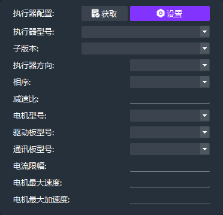

# FSA 使用参考

[TOC]

## 功能概述

*   控制模式
    *   电流控制模式
    *   速度控制模式
    *   位置控制模式
    *   PD控制模式（MIT）
*   其它功能
    *   自动回零
    *   摩擦补偿
    *   负载观测补偿
    *   PVCT滤波器
    *   控制器分频
    *   力矩估算反馈
*   保护功能
    *   过流、过载、过温保护
    *   角度传感器异常保护
    *   低压、过压保护
    *   网络心跳保护（主动、被动）

## 上位机介绍

[上位机文档链接](https://alidocs.dingtalk.com/i/nodes/a9E05BDRVQbZgLMvC9ZXxqrgJ63zgkYA?doc_type=wiki_doc)

## FSA CPP SDK

> [新版 FSA CPP SDK](https://gitee.com/FourierIntelligence/fsacppsdk.git)

## 控制模式

### 电流控制模式

* 控制框图

* 电流模式关键 API

| 接口名称                                                 | 描述                      |
|:-----------------------------------------------------|:------------------------|
| `int EnableCurControl()`                             | 使能电流模式                  |
| `int SetCurrent(const double& cur)`                  | 设置电流环目标电流 $I_{q_{set}}$ |
| `int GetPVCT(double& pos, double& vel, double& cur)` | 获取执行器的位置速度电流力矩          |

### 速度控制模式

* 控制框图

* 速度模式关键 API

| 接口名称                                                       | 描述                                     |
|:-----------------------------------------------------------|:---------------------------------------|
| `int EnableVelControl()`                                   | 使能速度模式                                 |
| `int SetVelocity(const double& vel, const double& cur_ff)` | 设置目标速度 $\dot{q}_d$ 和电流前馈 $I_{q_{set}}$ |
| `int GetPVCT(double& pos, double& vel, double& cur)`       | 获取执行器的位置速度电流力矩                         |

### 位置控制模式

* 位置模式关键 API

| 接口名称                                                                             | 描述                                                  |
|:---------------------------------------------------------------------------------|:----------------------------------------------------|
| `int EnablePosControl()`                                                         | 使能位置模式                                              |
| `int SetPosition(const double& pos, const double& vel_ff, const double& cur_ff)` | 设置目标位置 $q_{d}$、速度前馈 $\dot{q}_d$ 和电流前馈 $I_{q_{set}}$ |
| `int GetPVCT(double& pos, double& vel, double& cur)`                             | 获取执行器的位置速度电流力矩                                      |

### PD控制模式

PD控制器输出为力矩，执行器内部含有电流力矩标定曲线、比使用Kt值进行电流力矩转换更加精确

* PD 模式关键 API

| 接口名称                                                                             | 描述                                                  |
|:---------------------------------------------------------------------------------|:----------------------------------------------------|
| `int EnablePDControl()`                                                          | 使能 PD 模式                                            |
| `int SetPosition(const double& pos, const double& vel_ff, const double& tor_ff)` | 设置目标位置 $q_{d}$、速度前馈 $\dot{q}_d$ 和电流前馈 $I_{q_{set}}$ |
| `int GetPVCT(double& pos, double& vel, double& cur)`                             | 获取执行器的位置速度电流力矩                                      |
| `int SetTorqueLimitMax(const double& torque_limit_max )`                         | 设置最大力矩 $\tau_{max}$                                 |

### PD & 三环 PD 控制参数转换

* 串联 PD 控制

$$
I_{q_{set_{j}}} = i K_{d}^{old} (K_{p}^{old} q_{err} G_{\theta} - \dot{q} G_{\omega})
$$

* 并联 PD 控制

$$
I_{q_{set_{j}}} = \frac{(K_{p}^{new} q_{err} - K_{d}^{new} \dot{q}) G_{pd}}{K_{t}}
$$

* 串联参数到并联参数

$$
K_{p}^{parallel} = \frac{i K_{t} K_{p}^{series} K_{d}^{series} G_{\theta}}{G_{pd}}
$$

$$
K_{d}^{parallel} = \frac{i K_{t} K_{d}^{series} G_{\omega}}{G_{pd}}
$$

* 并联参数到串联参数

$$
K_{p}^{series} = \frac{K_{p}^{parallel} G_{\omega}}{K_{d}^{parallel} G_{\theta}}
$$

$$
K_{d}^{series} = \frac{K_{d}^{parallel} G_{pd}}{i K_{t} G_{\omega}}
$$

### 符号表

|       符号        |              值               |        单位        |                    释义                    |
|:---------------:|:----------------------------:|:----------------:|:----------------------------------------:|
|     $q_{d}$     |              变量              |    $\rm{deg}$    |                   目标位置                   |
|       $q$       |              变量              |    $\rm{deg}$    |                   实际位置                   |
|    $q_{err}$    |              变量              |    $\rm{deg}$    |                   位置误差                   |
|  $\dot{q_{d}}$  |              变量              |   $\rm{deg/s}$   |                   目标速度                   |
|    $\dot{q}$    |              变量              |   $\rm{deg/s}$   |                   实际速度                   |
| $\dot{q}_{err}$ |              变量              |   $\rm{deg/s}$   |                   速度误差                   |
|  $I_{q_{set}}$  |              变量              |     $\rm{A}$     |                目标 $q$ 轴电流                |
|     $I_{q}$     |              变量              |     $\rm{A}$     |                实际 $q$ 轴电流                |
|    $\tau_d$     |              变量              | $\rm{N \cdot m}$ |                   目标力矩                   |
|  $T_{\omega}$   |            $0.2$             |    $\rm{ms}$     |                 速度环控制周期                  |
|     $K_{t}$     |         常量（由执行器型号决定）         |        -         |                 电流力矩转换系数                 |
|       $i$       |         常量（由执行器型号决定）         |        -         |                   减速比                    |
|    $N_{pp}$     |         常量（由执行器型号决定）         |        -         |                   极对数                    |
|  $G_{\theta}$   |             $i$              |        -         |                  位置转换系数                  |
|  $G_{\omega}$   | $\frac{i \cdot N_{pp}}{360}$ |        -         |                  速度转换系数                  |
|    $G_{pd}$     |      $\frac{\pi}{180}$       |        -         | $\rm{deg/s} \rightarrow \rm{rad/s}$ 转换系数 |

## 其它功能

| 模式     | 接口                                                   | 描述                                   |
| -------- | ------------------------------------------------------ | -------------------------------------- |
| 回零模式 | `int SetReturnZeroMode(void)`                          | 使用出轴位置传感器回到设置的零点       |
| 摩擦补偿 | `int SetFrictionCompFlag(uint8_t friction_comp_flag)`  | 经过摩擦辨识后的执行器可以开启摩擦补偿 |
| 负载补偿 | `int SetInertiaCompensation(const double& inertia_ff)` | 减小低速时的转速波动                   |

### 摩擦补偿模型

### 回零模式

进入回零模式后执行器会按照**短弧轨迹**回到设置的零点、回零后角度置零。注意在回零过程中

### 负载补偿&力矩反馈

1、负载补偿：内置龙伯格负载观测器实时固件执行器的负载力矩$\hat{T_L}$，补偿负载力矩乘以一个增益系数G经过电流力矩转换后前馈到电流环的目标电流。

2、力矩反馈：负载力矩$\hat{T_L}$经过减速比放大后为反馈转矩

观测器大致框图如下：

### PVCT滤波器

PVCT反馈数据由控制环路实际使用的PVCT分别进过四个一阶低通滤波器后反馈到上层（注意：电流C与估算转矩T的滤波截止频率配置使用同一个参数）

滤波器传递函数如下：
$$
G(s)_{Lpf} = \frac{\omega_c}{s+\omega_c}
$$

### 控制器分频

位置环、速度环、PD环均可以通过配置分频系数实现基于电流环20KHz的分频运行，例如把PD环的分频系数配置为20，PD环的实际运行频率则为1KHz

## 执行器状态监控

| 功能           | 接口                                                                                       | 描述 |
|--------------|------------------------------------------------------------------------------------------|----|
| 母线电压反馈       | `int GetVBus(float& VBus )`                                                              |    |
| MOS / 绕组温度反馈 | `int FastGetNtcTemperature(float& out_mos_temperature, float& out_armature_temperature)` |    |
| 错误码反馈        | `int GetPVCTError(FSAConfig::pvct_errcode_t& pvct_errcode)`                              |    |

## 执行器配置

### 控制类配置

| 功能            | 接口                                                                                                                                 | 描述                                          |
|---------------|------------------------------------------------------------------------------------------------------------------------------------|---------------------------------------------|
| 立即生效 PID 配置   | `int SetPIDParams(FSAPIDParams& pidparams)`                                                                                        | 重启后失效                                       |
| 立即生效 PD 配置    | `int SetPDParams(FSAPIDParams& pidparams)`                                                                                         | 重启后失效                                       |
| PD 模式最大力矩配置   | `int SetTorqueLimitMax(const double& torque_limit_max);`                                                                           |                                             |
| SetPVC 超时保护配置 | `int SetPVCTimeoutProtect(uint32_t count, const set_pvc_timeout_protect_config_t& config, ack_ret_t& set_pvc_timeout_protect_ret)` | 可以配置多长时间内执行器没有收到 `SetPVC` 指令则自动切换到某个控制模式且报错 |

### 其它配置

Python 脚本或上位机配置

* 执行器方向配置
* 执行器校准
* 执行器设置零位
* 执行器启用双编配置
* 网络心跳保护配置

